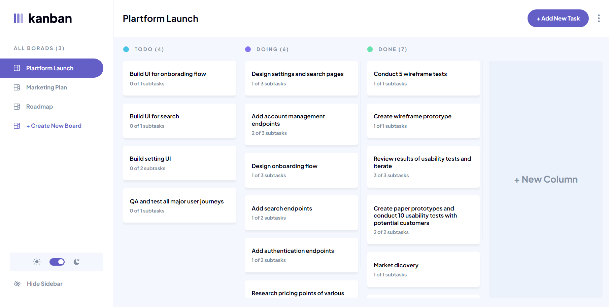
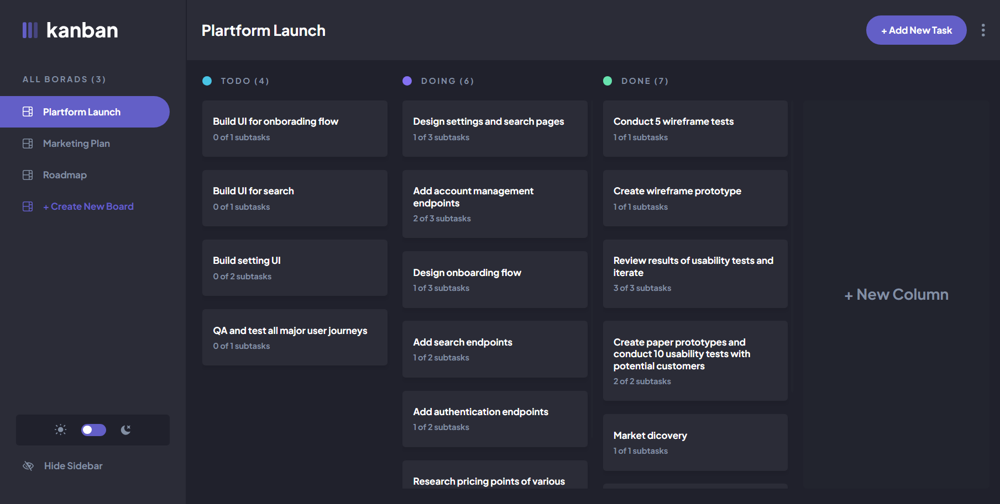
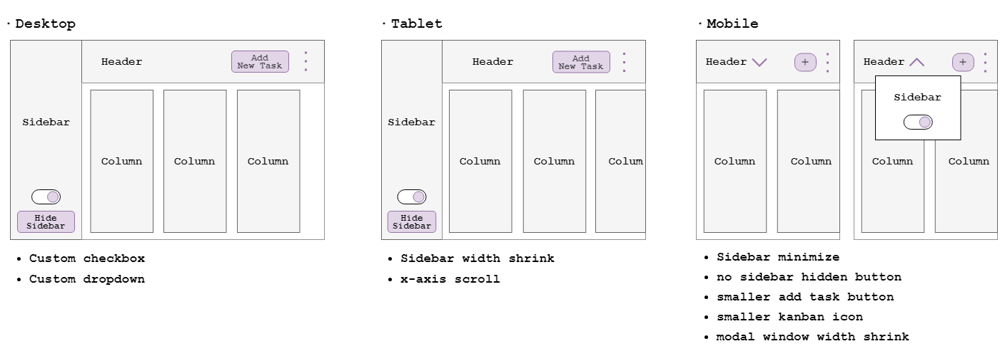
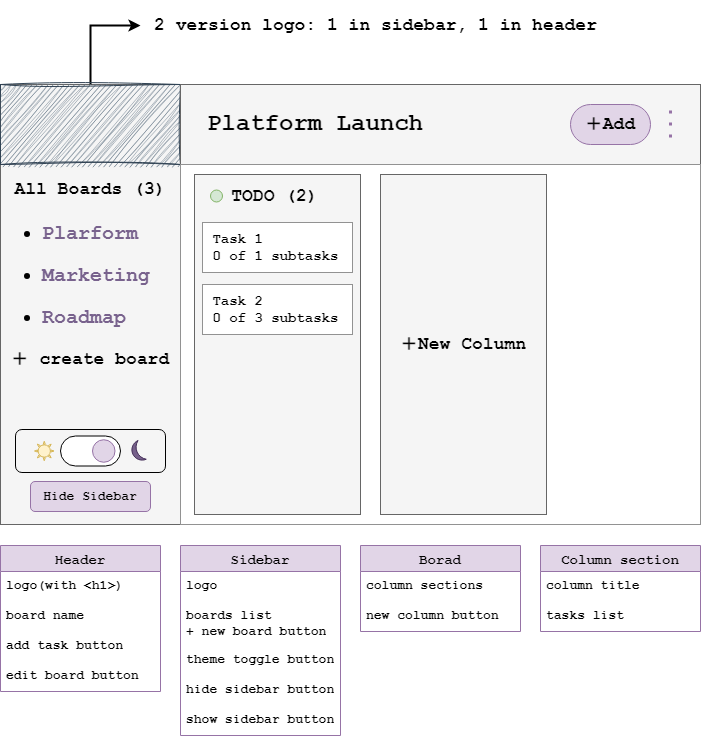
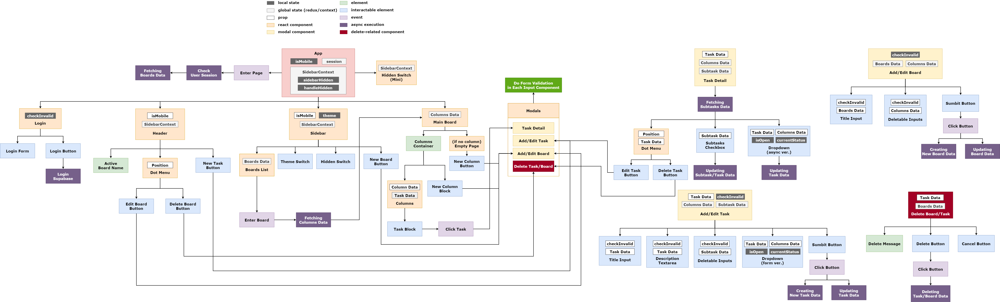
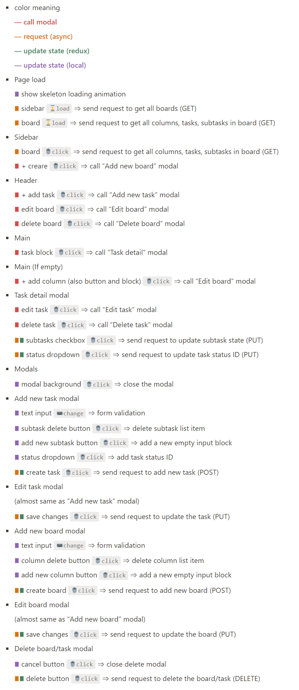

# Frontend Mentor - Kanban task management web app solution

This is a solution to the [Kanban task management web app challenge on Frontend Mentor](https://www.frontendmentor.io/challenges/kanban-task-management-web-app-wgQLt-HlbB). Frontend Mentor challenges help you improve your coding skills by building realistic projects.

## Table of contents

- [Overview](#overview)
  - [The challenge](#the-challenge)
  - [Screenshot](#screenshot)
  - [Links](#links)
- [My process](#my-process)
  - [Built with](#built-with)
  - [Wireframe](#wireframe)
  - [Components structure](#components-structure)
  - [Events list](#events-list)
  - [What I learned](#what-i-learned)
  - [Useful resources](#useful-resources)
- [Author](#author)

## Overview

### The challenge

Users should be able to:

- View the optimal layout for the app depending on their device's screen size
- See hover states for all interactive elements on the page
- Create, read, update, and delete boards and tasks
- Receive form validations when trying to create/edit boards and tasks
- Mark subtasks as complete and move tasks between columns
- Hide/show the board sidebar
- Toggle the theme between light/dark modes
- **Bonus**: Allow users to drag and drop tasks to change their status and re-order them in a column
- **Bonus**: Keep track of any changes, even after refreshing the browser (`localStorage` could be used for this if you're not building out a full-stack app)
- **Bonus**: Build this project as a full-stack application

### Screenshot





### Links

- Live Site URL: [Live site on Netlify](https://your-live-site-url.com)
- Solution URL: [Solution page on Frontend Mentor](https://your-solution-url.com)

## My process

### Built with

- Desktop-first workflow
- Semantic HTML5 markup
- CSS custom properties
- SCSS - CSS Preprocessor
- [React](https://reactjs.org/) - JavaScript library
- [React-Redux](https://react-redux.js.org/) - JavaScript library
- [react-beautiful-dnd](https://github.com/atlassian/react-beautiful-dnd) - JavaScript library
- [supabase](https://supabase.com/) - an open source Firebase alternative

### Wireframe




### Components structure



### Events list



### What I learned

- Using CSS variables and HTML dataset property to manage the theme switching

  **Reference:** [🔗](https://www.youtube.com/watch?v=Xk12JtYG8rw)

  ```html
  <html data-theme="light"></html>
  ```

  ```css
  :root[data-theme="light"] {
    --color-basic: #fff;
    --color-background: #f4f7fd;
    /* ...and others */
  }

  :root[data-theme="dark"] {
    --color-basic: #2b2c37;
    --color-background: #20212c;
    /* ...and others */
  }
  ```

- Using `pointer-events` property to trigger parent element hover effect by hovering child element

  **Reference:** [🔗](https://stackoverflow.com/questions/8114657/how-to-style-the-parent-element-when-hovering-a-child-element)

  ```css
  .parent-class {
    pointer-events: none;
  }

  .child-class {
    pointer-events: auto;
  }
  ```

- Using `useRef` to manage the form data

  **Reference:** [🔗](https://javascript.plainenglish.io/rethinking-the-data-management-for-react-forms-de1a78fe328)

  ```js
  import { useRef } from "react";

  function useFormData(initialData = {}) {
    const formData = useRef(initialData);
    const getFormData = () => formData;
    const handleFormChange = (formData, key) => {
      return (value) => {
        formData.current = { ...formData.current, [key]: value };
      };
    };

    return [getFormData, handleFormChange];
  }
  ```

- Using `rejectWithValue(errorPayload)` to reject the async thunk when certain situation

  **Reference:** [🔗](https://redux-toolkit.js.org/api/createAsyncThunk#handling-thunk-errors)

  ```js
  const fetchBoards = createAsyncThunk(
    "boards/fetch",
    async (_, { rejectWithValue }) => {
      const { data, error: getBoardError } = await supabase
        .from("boards")
        .select("*")
        .order("id", { ascending: true });

      if (getBoardError) {
        return rejectWithValue("Fetch boards error");
      } else {
        return data;
      }
    }
  );
  ```

### Useful resources

- [react-icons](https://react-icons.github.io/react-icons) - It is a very useful package. I can add tons of icons by just importing it, very convenient and efficient.
- [react-responsive](https://github.com/yocontra/react-responsive) - This package can help us to detect screen size to change JSX content in React.

## Author

- Website - [Yi-Shin Jheng](https://github.com/Yishin-Jheng)
- Frontend Mentor - [@Yishin-Jheng](https://www.frontendmentor.io/profile/Yishin-Jheng)
