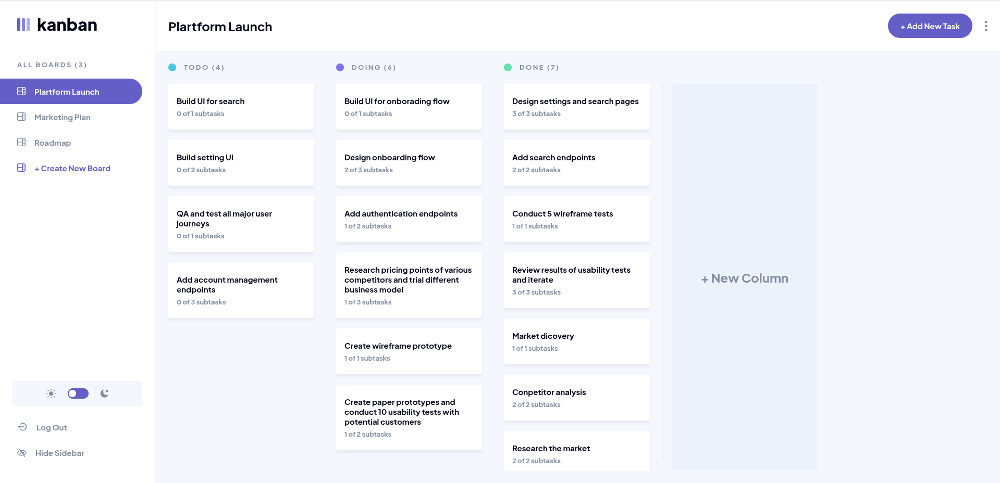
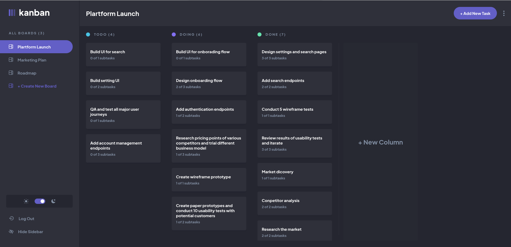

# Frontend Mentor - Kanban task management web app solution

This is a solution to the [Kanban task management web app challenge on Frontend Mentor](https://www.frontendmentor.io/challenges/kanban-task-management-web-app-wgQLt-HlbB). Frontend Mentor challenges help you improve your coding skills by building realistic projects.

這是在 Frontend Mentor 上的一個 [Kanban task management 網頁應用挑戰](https://www.frontendmentor.io/challenges/kanban-task-management-web-app-wgQLt-HlbB) 的開發成果。Frontend Mentor 希望藉由打造更貼近真實情境的專案題目，來幫助人們提升程式開發能力。

- Live Demo: https://kanban-task-management-yishin.netlify.app/

## Table of contents

- [Overview 概覽](#overview-概覽)
  - [The challenge 挑戰內容](#the-challenge-挑戰內容)
  - [Other features 其他功能](#other-features-其他功能)
  - [Screenshot 專案截圖](#screenshot-專案截圖)
- [My process 開發過程](#my-process-開發過程)
  - [Built with 使用技術](#built-with-使用技術)
  - [Refactoring 重構流程](#refactoring-重構流程)
  - [What I learned 學習收穫](#what-i-learned-學習收穫)
  - [Useful resources 實用資源](#useful-resources-實用資源)
- [Author 作者](#author-作者)

## Overview 概覽

### The challenge 挑戰內容

Users should be able to:

- View the optimal layout for the app depending on their device's screen size
- See hover states for all interactive elements on the page
- Create, read, update, and delete boards and tasks
- Receive form validations when trying to create/edit boards and tasks
- Mark subtasks as complete and move tasks between columns
- Hide/show the board sidebar
- Toggle the theme between light/dark modes
- **Bonus**: Allow users to drag and drop tasks to change their status <s>and re-order them in a column</s>
- **Bonus**: Keep track of any changes, even after refreshing the browser
- <s>**Bonus**: Build this project as a full-stack application</s>

Note: Items with strikethrough are not implemented. Data persistence is currently handled by Supabase rather than a self-built backend.

使用者應該能夠：

- 依照裝置的螢幕尺寸，看到最合適的版面配置
- 看到頁面上所有可互動元素的 hover 狀態
- 新增、讀取、更新與刪除版塊和任務
- 在新增或編輯版塊與任務時，收到必填欄位的驗證提示
- 將子任務標記為已完成，並在不同狀態欄位之間移動任務
- 隱藏或顯示看板側邊欄
- 在淺色與深色模式之間切換主題
- **加分項目**：讓使用者透過拖放任務來變更狀態，<s>並在同一欄位中重新排序</s>
- **加分項目**：即使重新整理瀏覽器，也能保留所有變更
- <s>**加分項目**：將這個專案做成全端應用程式</s>

註記: 加上刪除線的項目並未實作。目前資料的保存是使用 supabase 而非自行建置的後端。

### Other features 其他功能

Besides the basic features required by the challenge, the following were also added:

- An account login page
- A logout button in the sidebar
- An empty state when no board exists yet
- `*` marks on required fields
- Loading animations on form submit buttons

除了上一個小節當中列出的基本功能以外，也額外進行了以下內容調整：

- 新增了帳號登入畫面
- 在側邊欄中新增了登出按鈕
- 新增了尚未存在任何版塊時的空畫面
- 需要驗證的表單欄位新增了 `*` 提示標記
- 在表單的送出按鈕中新增 loading 動畫

### Screenshot 專案截圖





## My process 開發過程

### Built with 使用技術

- Desktop-first workflow
- Semantic HTML5 markup
- SCSS - CSS Preprocessor
- CSS Modules - Locally scoped CSS
- [TypeScript](https://www.typescriptlang.org/) - typed superset of JavaScript
- [React](https://reactjs.org/) - JavaScript library for building user interfaces
- [TanStack Query (React Query)](https://tanstack.com/query/latest) - JavaScript library for server-state management
- [zustand](https://zustand.docs.pmnd.rs/) - JavaScript library for state-management
- [@hello-pangea/dnd](https://github.com/hello-pangea/dnd) - JavaScript library for drag and drop
- [supabase](https://supabase.com/) - an open source Firebase alternative
- [Vite](https://vite.dev/) - frontend build tool

### Refactoring 重構流程

The project was originally built in 2023 with Create React App, global SCSS and Redux ([source code before refactoring](https://github.com/Yishin-Jheng/kanban-task-management/tree/v1)). In 2026, it was refactored step by step.

這個專案最初在 2023 年以 create-react-app、全域 SCSS 與 Redux 進行開發（[重構前的原始碼](https://github.com/Yishin-Jheng/kanban-task-management/tree/v1)），並在 2026 年進行了分階段的重構。

1. **Build tool: CRA → Vite**

   Since Create React App is no longer maintained, switching to Vite provides a smoother development experience, keeps the tooling consistent with my other projects, and is better suited for the later TypeScript migration.

   由於 create-react-app 已不再維護，改用 Vite 能獲得流暢的開發體驗，且與其他個人專案的工具保持一致，也更適合後續的 TypeScript 遷移。

2. **Styling: global SCSS → CSS Modules (with SCSS)**

   Styles were moved into component-scoped `.module.scss` files, with [clsx](https://github.com/lukeed/clsx) for conditional class names. Besides making components and their styles easier to manage, this also prevents class name collisions.

   將樣式拆分為以元件為範圍的 `.module.scss` 檔案，並使用 [clsx](https://github.com/lukeed/clsx) 處理條件式 class 名稱。除了更方便管理元件與樣式之外，也能避免 class 名稱衝突。

3. **State management: Redux → TanStack Query + zustand**

   Redux previously handled both server data and UI state. Server data is now managed by TanStack Query, which takes care of fetching, caching and refetching after mutations. Global UI state is handled by zustand.

   In addition, some data syncing logic was moved to Supabase in this phase and is now done in a single RPC call, so the frontend no longer needs multiple API requests to complete a single data change.

   原本 Redux 同時負責伺服器資料與 UI 狀態。現在伺服器資料改由 TanStack Query 管理，由它處理資料抓取、快取，以及 mutation 後的重新抓取；全域的 UI 狀態則使用 zustand 來管理。

   此外，部分資料的同步邏輯也在此階段移至 supabase，並改由單一 RPC 完成，避免前端需要透過多次的 API 請求才能完成一次的資料改動。

4. **Language: JavaScript → TypeScript**

   The migration was done file by file, in the following order of priority: stores, API functions, custom hooks, components, and finally the app entry. Since global state and API data are used across many components, defining the upstream data types first made the downstream component migration smoother and reduced repeated rework.

   以逐檔轉換的方式進行，並根據以下優先順序進行重構：store、API function、custom hook、各個元件，最後則是應用程式入口。此順序考量了全域 state 與 API 資料會在多個元件中被使用，因此先確立上游的資料型別，能讓後續下游元件的重構更加順利，也能減少重複修改的成本。

### What I learned 學習收穫

- Since `e.target` is typed as `EventTarget` while `element.contains` only accepts a `Node` argument, the TypeScript check fails. Using `e.composedPath()` avoids this problem and better matches the expected behavior.

  由於 `e.target` 的型別為 `EventTarget`，但 `element.contains` 只接收 `Node` 型別的參數，導致 TS 的檢查無法通過。但使用 `e.composedPath` 的話則不會有型別問題，邏輯上也更加符合一般的操作預期。

  ```ts
  const handleClickOutside = function (e: MouseEvent) {
    const target = targetRef.current;

    if (target && !e.composedPath().includes(target)) {
      onClickOutside();
    }
  };
  ```

- Using `skipToken` in React Query lets TypeScript narrow the parameter types inside `queryFn`, which `enabled` cannot do. However, it is only safe when the skipping condition is part of the query key; otherwise, use `enabled` instead.

  使用 React Query 的 `skipToken` 能讓 TS 在 `queryFn` 中正確收斂參數型別，這是 `enabled` 做不到的。但只有當依賴參數包含在 query key 中時，`skipToken` 才是合適的選擇，否則應改用 `enabled`。

  **Reference link:** [🔗](https://tanstack.com/query/latest/docs/framework/react/guides/disabling-queries#typesafe-disabling-of-queries-using-skiptoken)

  ```ts
  useQuery({
    queryKey: ["columns", boardId],
    queryFn:
      typeof boardId === "number" ? () => getColumns({ boardId }) : skipToken,
  });

  useQuery({
    queryKey: ["boards"],
    queryFn: getBoards,
    enabled: typeof boardId === "number",
  });
  ```

### Useful resources 實用資源

- [react-icons](https://react-icons.github.io/react-icons) - It is a very useful package. You can add tons of icons by just importing it.（提供了大量 icon 的實用套件）
- [react-responsive](https://github.com/yocontra/react-responsive) - This package can help us to detect screen size to change JSX content in React.（可以監聽螢幕尺寸，藉此在 React 中切換要顯示的內容。）
- [supabase's AI tools](https://supabase.com/docs/guides/ai-tools) - Official docs for Supabase's MCP server and Agent Skills, with detailed setup guides. Very practical and friendly for developers who are new to Supabase.（由官方提供的 MCP 與 Skill 文件，也有很詳細的導入說明，對於不熟悉 supabase 的開發者來說非常實用與友善）

## Author 作者

- Website - [Yi-Shin Jheng](https://github.com/Yishin-Jheng)
- Frontend Mentor - [@Yishin-Jheng](https://www.frontendmentor.io/profile/Yishin-Jheng)
